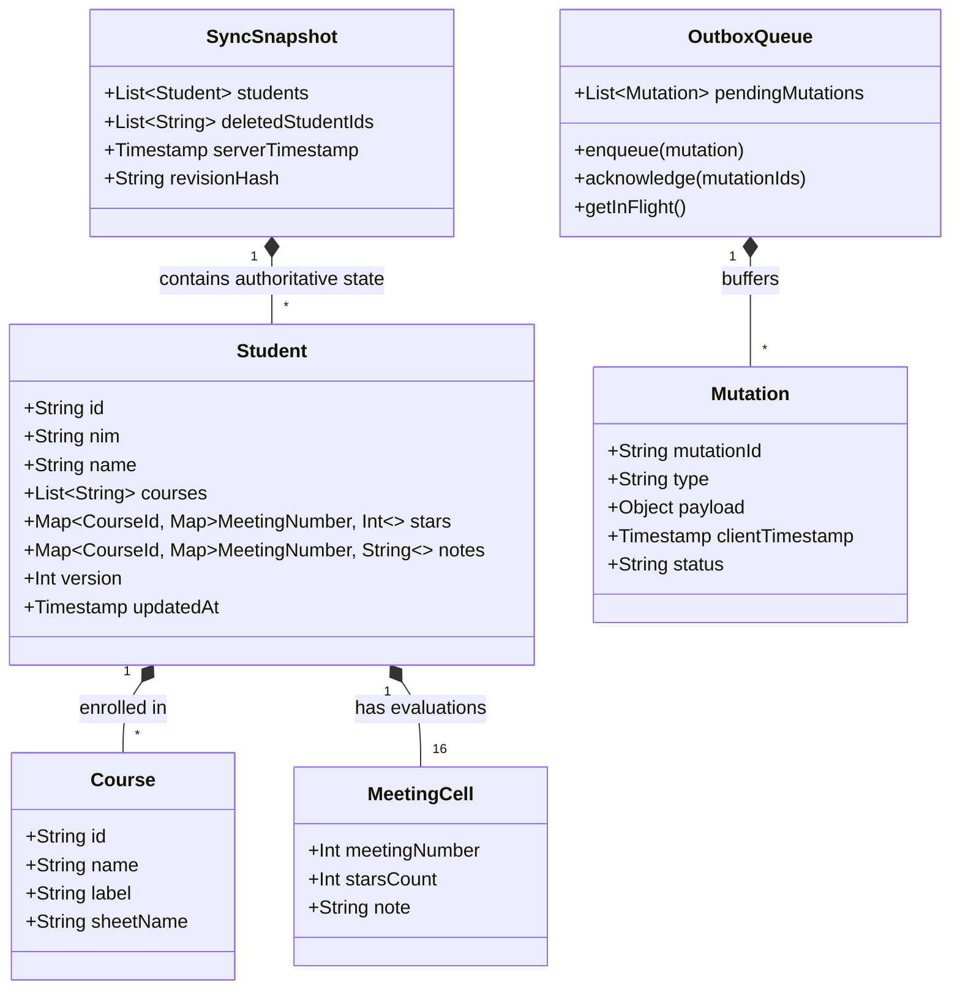
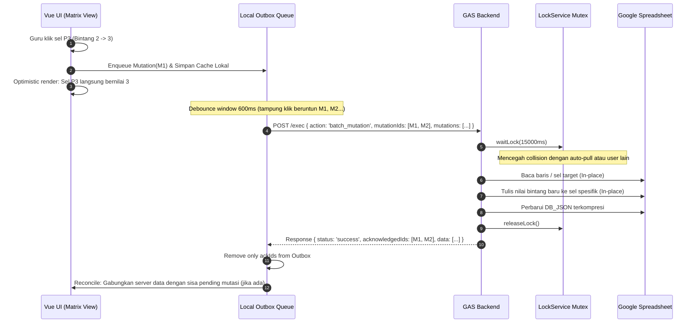

# Domain Model & Glossary: Portal Keaktifan Mahasiswi Sync Engine

Dokumen ini mendefinisikan bahasa bersama (*Ubiquitous Language*), model domain, entitas, siklus hidup mutasi, dan struktur data untuk sistem sinkronisasi keaktifan mahasiswi antara Web App Portal dan Google Spreadsheet.

---

## 1. Glossary (Ubiquitous Language)

| Istilah | Definisi |
| :--- | :--- |
| **Portal Keaktifan** | Aplikasi web interaktif berbasis Vue 3 yang digunakan dosen untuk merekap nilai keaktifan, bintang, dan presensi mahasiswi. |
| **Spreadsheet Authority** | Lembar kerja Google Spreadsheet yang berfungsi sebagai *Single Source of Truth* (SSOT) jangka panjang dan tempat arsip nilai resmi. |
| **Matriks Pertemuan (Matrix View)** | Tampilan tabel 16 pertemuan (P1 - P16) di mana setiap baris adalah mahasiswi dan setiap kolom adalah pertemuan untuk pengisian bintang secara cepat. |
| **Bintang Keaktifan (Star Rating)** | Nilai partisipasi mahasiswi per pertemuan per mata kuliah. Nilai berupa bilangan bulat non-negatif ($\ge 0$). Nilai 0 berarti tidak ada bintang. |
| **Mutasi (Mutation)** | Objek diskrit yang merepresentasikan satu perubahan atomik (misal: ubah bintang, tambah catatan, tambah/edit/hapus mahasiswi) yang memiliki ID unik dan timestamp. |
| **Outbox Queue** | Antrean FIFO lokal di browser (*localStorage*) yang menampung mutasi sebelum berhasil diterima dan diakui (*ACK*) oleh backend. |
| **Mutation ACK (Acknowledgment)** | Mekanisme di mana backend mengirimkan daftar ID mutasi yang telah berhasil diproses, sehingga frontend hanya menghapus mutasi yang sudah terkonfirmasi. |
| **Optimistic UI with Re-application** | Pola UI di mana perubahan langsung ditampilkan ke layar pengguna secara instan, dan jika data ditarik dari server, mutasi lokal yang masih pending diaplikasikan kembali (*replayed*) di atas snapshot server. |
| **Script Lock (LockService)** | Mekanisme mutex di Google Apps Script untuk mencegah dua eksekusi concurrent (`doGet` dan `doPost`) saling merusak data lembar kerja (*race condition*). |
| **Chunked DB_JSON** | Tab tersembunyi di Spreadsheet yang menyimpan JSON serial lengkap dari seluruh entitas untuk mempercepat pembacaan dan pemulihan darurat tanpa batas sel 50.000 karakter. |
| **In-Place Cell Update** | Pembaruan sel Spreadsheet langsung pada koordinat baris dan kolom yang spesifik tanpa melakukan `clearContents()` pada seluruh lembar kerja. |

---

## 2. Domain Model

---

## 3. Lifecycle Mutasi & Sinkronisasi

